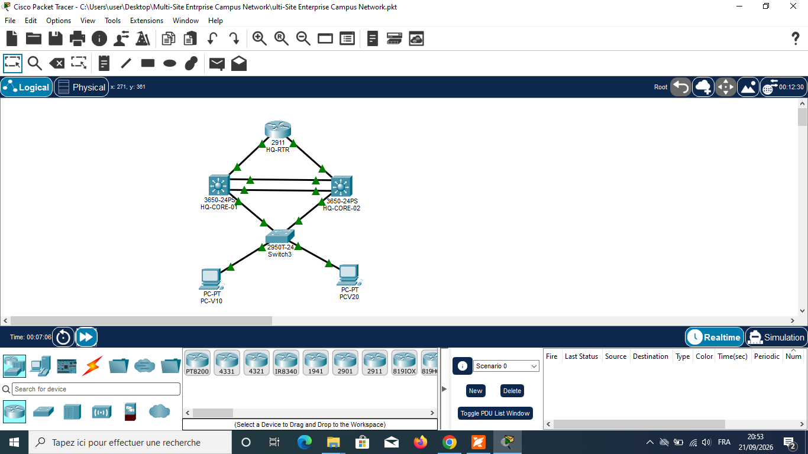

# Multi-Site Enterprise Campus Network

A redundant, highly available enterprise campus network designed and simulated in **Cisco Packet Tracer**.

## Network Topology

### Key Features
* **Core Redundancy**: Dual Cisco 3650 Core Switches (`HQ-CORE-01` & `HQ-CORE-02`) running **HSRP** for default gateway redundancy and **LACP (EtherChannel)** for trunking.
* **VLAN Segmentation**: Dedicated VLANs (`VLAN 10` for Sales, `VLAN 20` for HR) configured on `Switch3`.
* **Routed Core-to-Edge**: Subnetted point-to-point Layer 3 links routing network traffic to the edge router (`HQ-RTR`).

---

## IP Addressing & VLAN Scheme

| Device | Interface | IP Address | Subnet Mask | Role / Notes |
| :--- | :--- | :--- | :--- | :--- |
| **HQ-RTR** | `Gi0/0` | `10.0.12.2` | `255.255.255.252` | Link to HQ-CORE-01 |
| **HQ-RTR** | `Gi0/1` | `10.0.23.2` | `255.255.255.252` | Link to HQ-CORE-02 |
| **HQ-CORE-01** | `Gi1/0/3` | `10.0.12.1` | `255.255.255.252` | Uplink to Router |
| **HQ-CORE-01** | `Vlan10` | `192.168.10.2` | `255.255.255.0` | Active Gateway (VLAN 10 - Management) |
| **HQ-CORE-01** | `Vlan20` | `192.168.20.2` | `255.255.255.0` | Active Gateway (VLAN 20 - Corporate_Data) |
| **HQ-CORE-01** | `Vlan30` | `192.168.30.2` | `255.255.255.0` | Active Gateway (VLAN 30 - Voice) |
| **HQ-CORE-01** | `Vlan99` | `192.168.99.2` | `255.255.255.0` | Active Gateway (VLAN 99 - Guest) |
| **HQ-CORE-02** | `Gi1/0/3` | `10.0.23.1` | `255.255.255.252` | Uplink to Router |
| **HQ-CORE-02** | `Vlan10` | `192.168.10.3` | `255.255.255.0` | Standby Gateway (VLAN 10 - Management) |
| **HQ-CORE-02** | `Vlan20` | `192.168.20.3` | `255.255.255.0` | Standby Gateway (VLAN 20 - Corporate_Data) |
| **HQ-CORE-02** | `Vlan30` | `192.168.30.3` | `255.255.255.0` | Standby Gateway (VLAN 30 - Voice) |
| **HQ-CORE-02** | `Vlan99` | `192.168.99.3` | `255.255.255.0` | Standby Gateway (VLAN 99 - Guest) |
| **PC-V10** | `Fa0` | `192.168.10.10` | `255.255.255.0` | Connected to `Fa0/1` (VLAN 10) |
| **PC-V20** | `Fa0` | `192.168.20.10` | `255.255.255.0` | Connected to `Fa0/2` (VLAN 20) |
